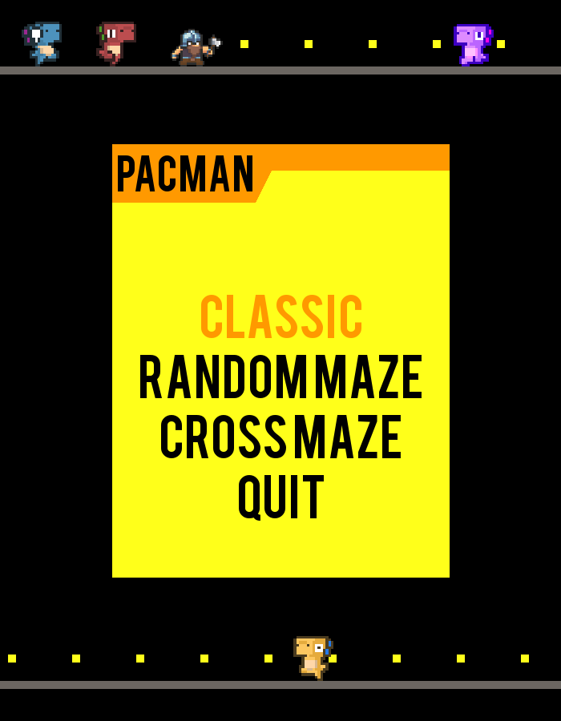
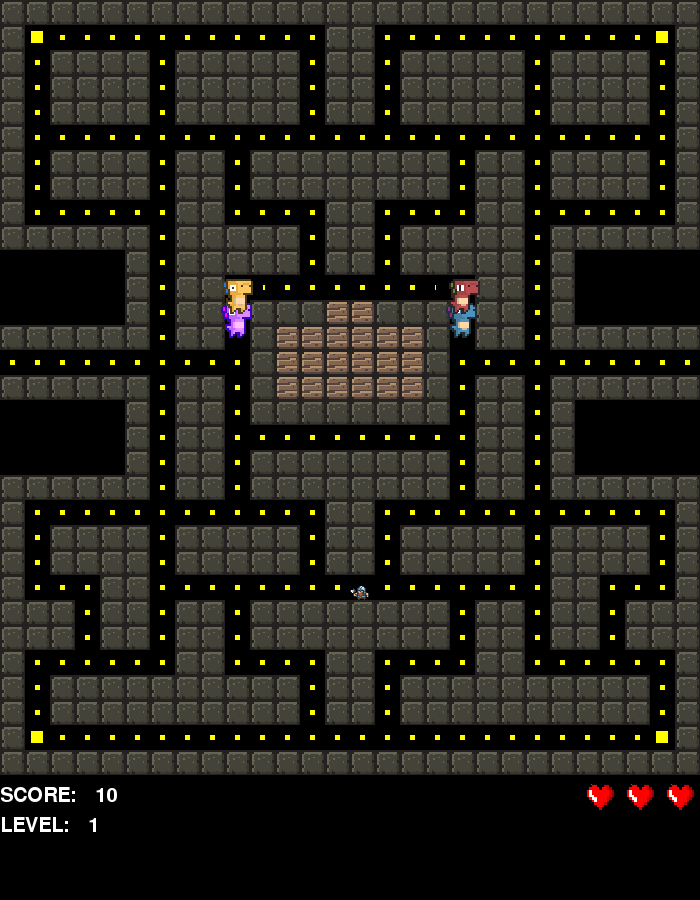
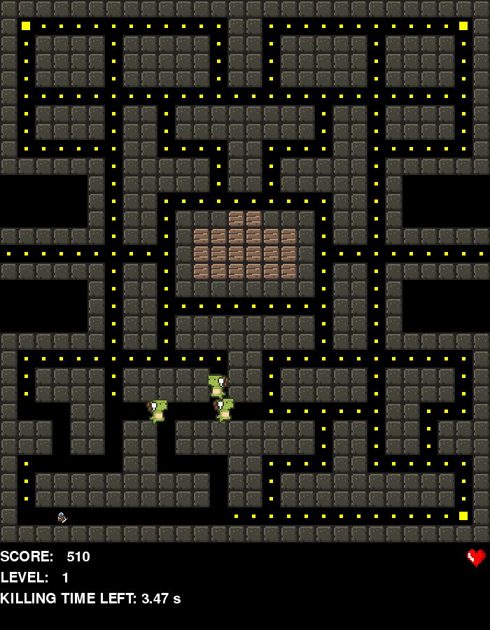
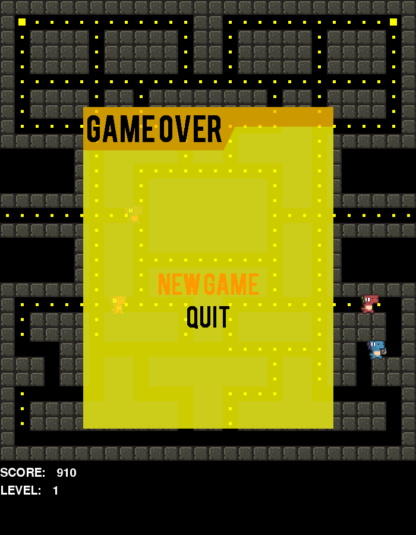

# Pacman Game

A custom-looking version of popular Pacman game, written in Python.

Libraries used in this project:
* Pygame
* PygameMenu

### How to run
1. Run game.py
2. In the future commits .exe release will be published.

## Contributors

* Olgierd Królik [olliekrk](https://github.com/olliekrk)
* Krzysztof Olewiński [krisolew](https://github.com/krisolew)

## Game Gallery

## TODO
* ~~main menu (after starting game) + pause menu (after pressing ESC)~~
* ~~displaying game statistics like: lives left, points acquired, game time, etc~~
* ~~events screens (delays, info) for events like: game over, next level, life loss, big dot eaten, etc~~
* **board layout generator**
* background music + events sounds (pygame.mixer)
* alternative controls by mouse buttons
* _?multiplayer?_